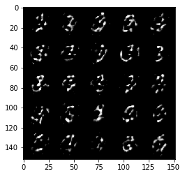

# AutoEncoder

# Hyperparameters

```python
...
batch_size=128
epochs=20
lr= 1e-3
...
```
**EXPERIENCE:**
> Learning Rate is pretty important hyperparameter in this problem! I use `lr=0.1` and get BAD results.

# Network
## dense layer
```python
def dense(num_in, num_out):
    return nn.Sequential(
        nn.Linear(num_in, num_out),
        nn.BatchNorm1d(num_out),
        nn.ReLU(inplace=True),
        )
```
## decoder module
```python
def decoder(image_dim, num_hidden):
    return nn.Sequential(
        dense(image_dim, 4*num_hidden),
        dense(4*num_hidden, 2*num_hidden),
        dense(2*num_hidden, num_hidden)
    )
```
## encoder module
```python
def encoder(num_hidden, image_dim):
    return nn.Sequential(
        dense(num_hidden, 2*num_hidden),
        dense(2*num_hidden, 4*num_hidden),
        dense(4*num_hidden, image_dim)
    )
```
## Net module
```python
class Net(nn.Module):
    def __init__(self, image_dim, num_hidden):
        super(Net, self).__init__()

        self.decod = decoder(image_dim, num_hidden)
        self.encod = encoder(num_hidden, image_dim)

    def forward(self, x):
        x=torch.flatten(x, start_dim=1)
        x = self.decod(x)
        x = self.encod(x)
        return x
```

# Loss function
```python
# instance of model
model=Net(784, 128).to(device)
# criterion
criterion = nn.MSELoss()
# optimizer
optimizer=optim.Adam(model.parameters(), lr=lr)
```

# Training
```python
...
...
for epoch in range(1,epochs+1):
    ...
    ...
    model.train()
    for iter_train, (image, _) in enumerate(tqdm(train_loader), 1):
    ...
    ...
    loss = criterion(y_hat, torch.flatten(image, start_dim=1))
    ...
    ...
```

# Validation
```python
...
...
for epoch in range(1,epochs+1):
    ...
    ...
    model.eval()
    for iter_valid, (image, _) in enumerate(valid_loader, 1):
    ...
    ...
    loss = criterion(y_hat, torch.flatten(image, start_dim=1))
    ...
    ...
    if iter_valid == 1:
        image_show = image
```

# Experiences
## 1st try
Dominant sections:
1. lr = 0.1
2. Last dense layer of encoder module have NOT ReLu activation.

AE output (epoch 1st):  
  

AE output (epoch 18th):  


## 2nd try
adopted from ([Link](https://medium.com/pytorch/implementing-an-autoencoder-in-pytorch-19baa22647d1)).  
Dominant sections:
1. lr = 1e-3
2. Last dense layer of encoder module HAVE ReLu activation.

AE output (epoch 1st):  
  

AE output (epoch 18th):  


# Reuslts
One mini-batch - 25 instance - Validation data:  
  

Model(AutoEncoder) output:  


# Noise to Encoder
We feed a mini-batch noise `(num_sample = 128, num_feature = 128)` to **encoder** section of **trained model**.

```python
noise_input = torch.normal(mean = 0*torch.ones(128,128), std = 1*torch.ones(128,128)).to(device)
show_tensor_images(model.encod(noise_input))
```
> 

Realistic image has not been reconstructed (why?).