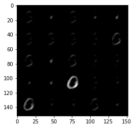
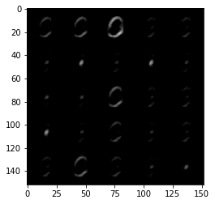
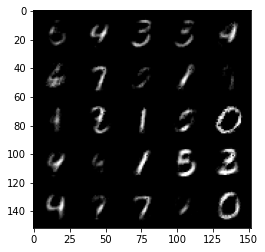
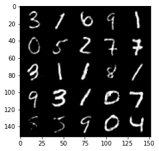
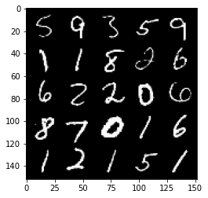
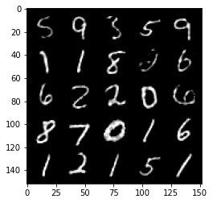

# AutoEncoder
## first try results
1. epoch 1st

2. epoch 18th

## second try results 
source : Medium ([Link](https://medium.com/pytorch/implementing-an-autoencoder-in-pytorch-19baa22647d1))

Changes:
1. lr=0.1 => lr=1e-3
2. use RELU after every layer
3. change architecture:
   1. first arch (784,4*128,2*128,128,128,2*128,4*128,784)
   2. second arch (784, 128, 128, 128, 784)

1.epoch 1st

2. epoch 18th

# Final Result

- A mini-batch (validation data):

- output of AE :

