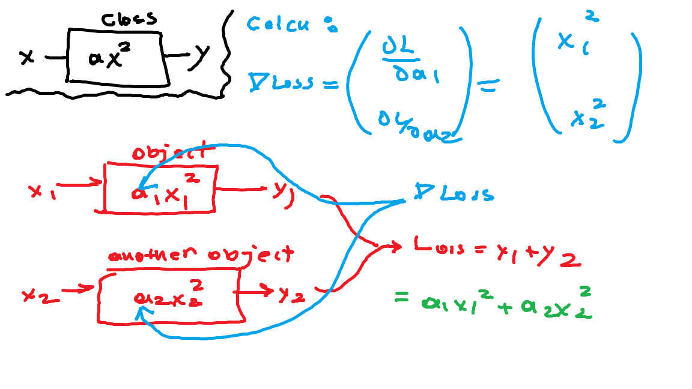
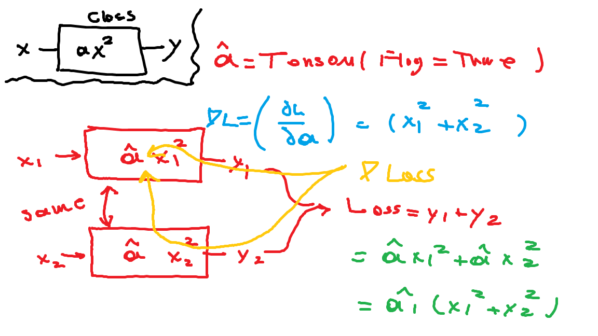
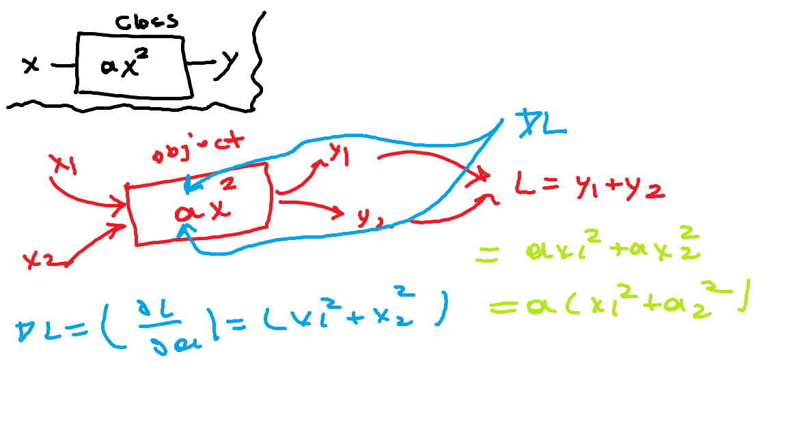

# Torch.nn

# Weight Sharing / Parameter Sharing
## Experience 01

## Experience 02

## Experience 03

# Parameter

# Module
## Properties
### self.training : Bool
### self._parameters : Parameter 
### self._modules : Dictionary

## Methods
### add_module
### get_submodule
### get_parameter
### apply
### children
### parameters
### modules
### require_grad
### zero_grad

# Sequential
# Conv2d
# ConvTranspose2d
# MaxPool2d
# ReLu
# Sigmoid
# BatchNorm1d
# Identity
# Dropout
# CrossEntropyLoss