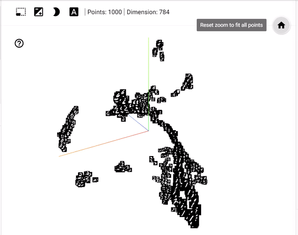

# MLP

# TensorBoard

## Installation
```bash
pip install tensorboard
```
```bash
conda install -c conda-forge tensorboard
```

## Update
```bash

```

## Terminal command
```bash
tensorboard --logdir=<tensorboard_folder>
```
**NOTE:**
> Sure that local directory is in where <tensorboard_folder> exist.

## Creating a loss and accuracy plot
### Independent plots
This perform by `add_scalar` statement.
##### new codes
```python
...
...
for epoch in range(1,epochs+1):
    for iter_train, (image, label) in enumerate(train_loader, 1):
        ...
        ...
        # -NEW- TensorBoard process
        writer.add_scalar("Loss Train", scalar_value= loss, global_step=step)
        writer.add_scalar("Accuracy Train", scalar_value= acc, global_step=step)
        step+=1
        writer.close()
        # -NEW- TensorBoard process
```
##### results


### Hold on plots
This perform by `add_scalars` statement.
##### new codes
```python
...
...
for epoch in range(1,epochs+1):
    for iter_train, (image, label) in enumerate(train_loader, 1):
        ...
        ...
        # -NEW- TensorBoard process
        writer.add_scalars("Loss/Accuracy", {'Loss' : loss, 'Accuracy': acc}, global_step=step)
        step+=1
        # -NEW- TensorBoard process
writer.close()
```
##### results


## Graph
**NOTE**
> Sure that name of method `def forward(self,x)` is `forward`
##### new codes
```python
# Hyperparaameter
batch_size=64

# TrainLoader
train_loader=DataLoader(train_data, batch_size= batch_size, num_workers=num_workers, sampler=train_sampler)

# Loss and Optimizer
model=Net()

# TesnorBoard File
root_tb=f'runs/batch {batch_size}'
writer = SummaryWriter(root_tb)

# -NEW- TensorBoard process
image,label=next(iter(train_loader))
writer.add_graph(model, image)
# -NEW- TensorBoard process
writer.close()
```
##### results


## Histogram
##### new codes
```python
...
...
step=0
for epoch in range(1,epochs+1):
    for iter_train, (image, label) in enumerate(train_loader, 1):
        ...
        ...
        # -NEW- TensorBoard process
        writer.add_histogram("FC1_Weights", model.fc1.weight, global_step=step)
        writer.add_histogram("FC2_Weights", model.fc2.weight, global_step=step)
        writer.add_histogram("FC3_Weights", model.fc3.weight, global_step=step)
        step+=1
        # -NEW- TensorBoard process
writer.close()
```
##### results


## mini-batch images
##### new code
```python
...
...
for epoch in range(1,epochs+1):
    for iter_train, (image, label) in enumerate(train_loader, 1):
        ...
        ...
        # -NEW- TensorBoard process
        writer.add_images("mini=batch data", image, global_step=iter_train)
        step+=1
        # -NEW- TensorBoard process
writer.close()
```
##### result


## mini-batch signals

## Hyperparameters Searching
##### new code
```python
# Hyperparaameter
epochs=1
for batch_size in [10,100,1000]:
    for lr in [0.1, 0.01, 0.001]:
        # TrainLoader
        train_loader=DataLoader(train_data, batch_size= batch_size, num_workers=num_workers, sampler=train_sampler)

        # Loss and Optimizer
        model=Net().to(device)
        criterion =nn.CrossEntropyLoss()
        optimizer=optim.SGD(model.parameters(), lr=lr)

        # TesnorBoard File
        root_tb=f'runs/batch {batch_size} LR {lr}'
        writer = SummaryWriter(root_tb)

        # Train
        for epoch in range(1,epochs+1):
            loss_train, acc_train = TC.train(model,train_loader, device, optimizer, criterion, epoch)

        # -NEW- TensorBoard process
        writer.add_hparams({'batch_size' : batch_size, 'LR' : lr} ,
                           {'Loss train' : loss_train, 'Accuracy train' : acc_train})
        # -NEW- TensorBoard process
        writer.close()
```
##### result


## Embedding Projector
##### new codes
```python
# desired datas that you want visualize
images, labels = train_data.data[:1000], train_data.targets[:1000]
# make TB file
writer = SummaryWriter(f"runs")
```

```python
# create "image labels" for classes.
label_image  = torch.unsqueeze(images,1)
# create "name labels" for class.
label_name=['0','1','2','3','4','5','6','7','8','9']
# replace every 0,1 label with related string
label_name = [label_name[lab] for lab in labels]
```

```python
# Features (Dimensions)
features = torch.flatten(images, start_dim=1).to(torch.float32)
writer.add_embedding(features,
                    metadata=label_name,
                     label_img =label_image )
writer.close()
```
##### result
