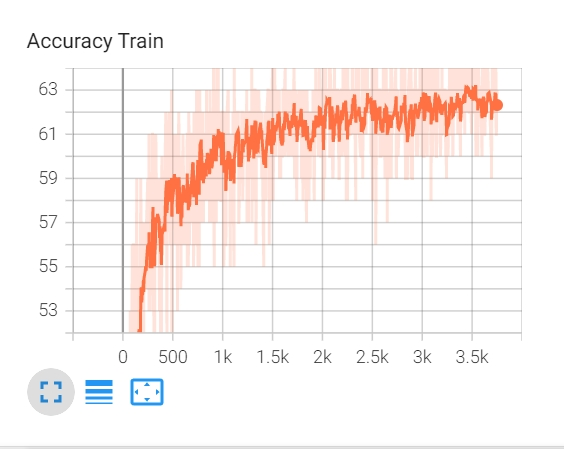
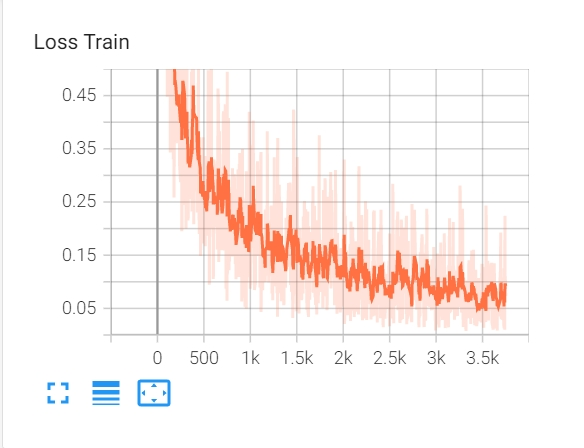
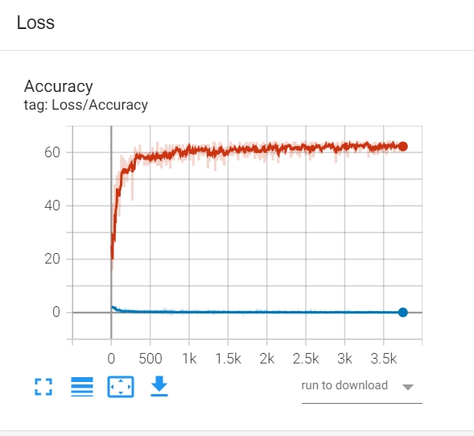
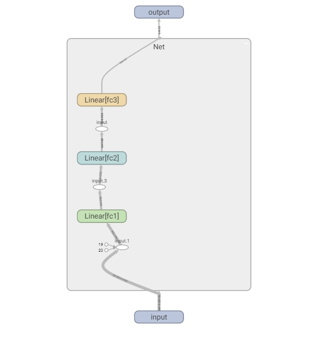
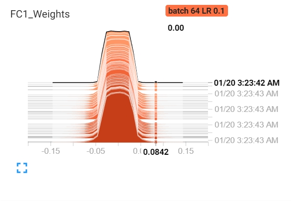
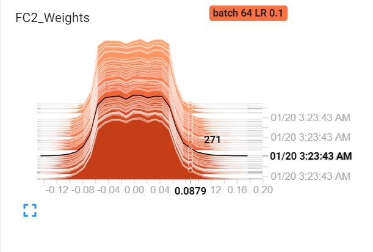
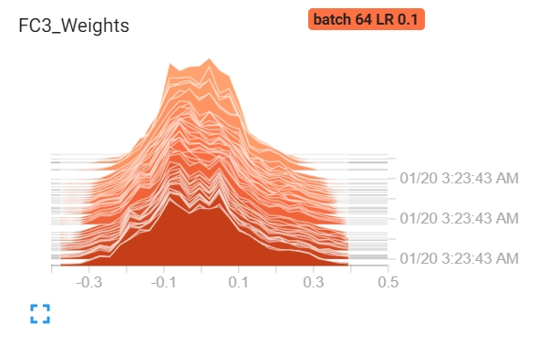
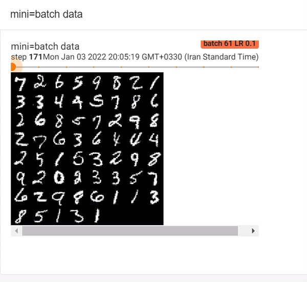

# MLP

# TensorBoard
**NOTE:**
> we would NOT use `TorchCommon.py` module in this TB tutorial.
##### original code
```python
# Hyperparaameter
epochs=5
batch_size=64
lr=0.1

# TrainLoader
train_loader=DataLoader(train_data, batch_size= batch_size, num_workers=num_workers, sampler=train_sampler)

# Loss and Optimizer
model=Net().to(device)
criterion =nn.CrossEntropyLoss()
optimizer=optim.SGD(model.parameters(), lr=lr)

# TesnorBoard File
root_tb=f'runs/batch {batch_size} LR {lr}'
writer = SummaryWriter(root_tb)

# Train
step=0
for epoch in range(1,epochs+1):
    for iter_train, (image, label) in enumerate(train_loader, 1):
        # preprocess and feedforward process
        image, label = image.to(device), label.to(device)
        optimizer.zero_grad()
        y_hat = model(image)
        # we want to track loss/acc
        loss = criterion(y_hat, label)
        acc = np.count_nonzero(label.to('cpu').numpy() == y_hat.argmax(dim=1).to('cpu').numpy())
        # updating process
        loss.backward()
        optimizer.step()
```

## Installation
## Update
## Terminal command

## Creating a loss and accuracy plot
### Independent plots
This perform by `add_scalar` statement.
##### new codes
```python
...
...
for epoch in range(1,epochs+1):
    for iter_train, (image, label) in enumerate(train_loader, 1):
        ...
        ...
        # -NEW- TensorBoard process
        writer.add_scalar("Loss Train", scalar_value= loss, global_step=step)
        writer.add_scalar("Accuracy Train", scalar_value= acc, global_step=step)
        step+=1
        writer.close()
        # -NEW- TensorBoard process
```
##### results


### Hold on plots
This perform by `add_scalars` statement.
##### new codes
```python
...
...
for epoch in range(1,epochs+1):
    for iter_train, (image, label) in enumerate(train_loader, 1):
        ...
        ...
        # -NEW- TensorBoard process
        writer.add_scalars("Loss/Accuracy", {'Loss' : loss, 'Accuracy': acc}, global_step=step)
        step+=1
        # -NEW- TensorBoard process
writer.close()
```
##### results


## Graph
**NOTE**
> Sure that name of method `def forward(self,x)` is `forward`
##### new codes
```python
# Hyperparaameter
batch_size=64

# TrainLoader
train_loader=DataLoader(train_data, batch_size= batch_size, num_workers=num_workers, sampler=train_sampler)

# Loss and Optimizer
model=Net()

# TesnorBoard File
root_tb=f'runs/batch {batch_size}'
writer = SummaryWriter(root_tb)

# -NEW- TensorBoard process
image,label=next(iter(train_loader))
writer.add_graph(model, image)
# -NEW- TensorBoard process
writer.close()
```
##### results


## Histogram
##### new codes
```python
...
...
step=0
for epoch in range(1,epochs+1):
    for iter_train, (image, label) in enumerate(train_loader, 1):
        ...
        ...
        # -NEW- TensorBoard process
        writer.add_histogram("FC1_Weights", model.fc1.weight, global_step=step)
        writer.add_histogram("FC2_Weights", model.fc2.weight, global_step=step)
        writer.add_histogram("FC3_Weights", model.fc3.weight, global_step=step)
        step+=1
        # -NEW- TensorBoard process
writer.close()
```
##### results




## mini-batch images
##### new code
```python
...
...
for epoch in range(1,epochs+1):
    for iter_train, (image, label) in enumerate(train_loader, 1):
        ...
        ...
        # -NEW- TensorBoard process
        writer.add_images("mini=batch data", image, global_step=iter_train)
        step+=1
        # -NEW- TensorBoard process
writer.close()
```
##### result


## mini-batch signals

## Hyperparameters Searching


## Tensorboard Embedding Projector