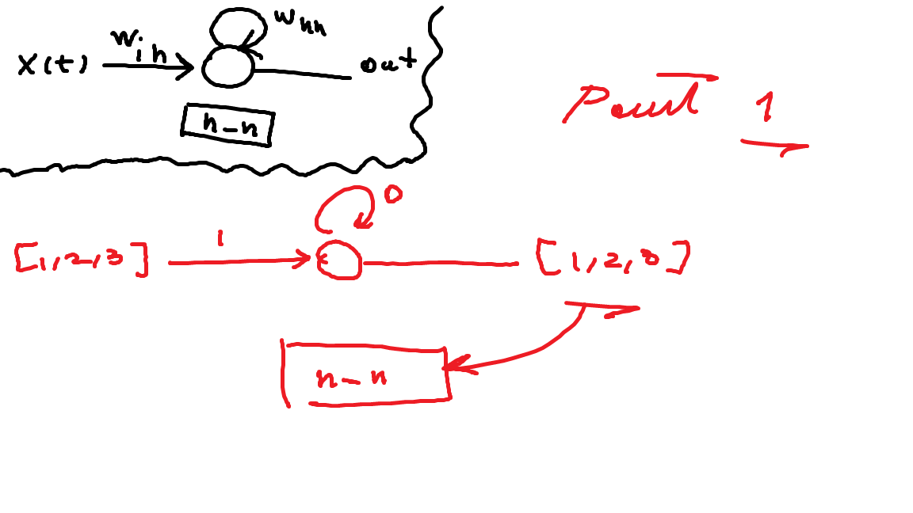
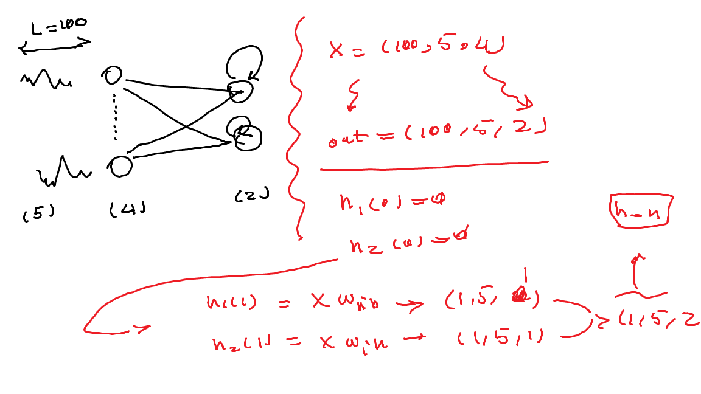

# Recurrent Neural Network 
**Sources:**
- [ ] https://stanford.edu/~shervine/teaching/cs-230/cheatsheet-recurrent-neural-networks
- [ ] https://www.ibm.com/cloud/learn/recurrent-neural-networks
- [ ] https://d2l.ai/chapter_recurrent-neural-networks/rnn.html#:~:text=Parameters%20of%20the%20RNN%20include,q%20of%20the%20output%20layer.

# RNN
## part one


## part two


# MNIST 
## hyperparameter
```python
# sequence length
L = 28
# number of inout node
Fin = 28
# number of hidden node
Fh = 256
# number of hidden layer (e.g "2" meaning that two block sequence together)
num_layer = 2
# number of output nodes
Fout = 10
...
batch_size=64
epochs=20
lr=0.1
```

## network
```python
class Net(nn.Module):
    def __init__(self, L, Fin, Fh, num_layer, Fout):
        super(Net, self).__init__()

        self.L = L
        self.Fin = Fin
        self.Fh = Fh
        self.num_layer = num_layer
        self.Fout = Fout

        self.rnn = nn.RNN (self.Fin, self.Fh, self.num_layer, batch_first=True)
        self.fc = nn.Linear(self.Fh * self.L, self.Fout)

    def forward(self, x):
        # Don't use view
        x = x.reshape(-1, self.L, self.Fin)
        x, _ = self.rnn(x)
        x = x.reshape(x.shape[0], -1)
        x = self.fc(x)
        return x
```

## create model / loss function / optimizer 
```python
#create model and set loss function and optimizer
model=Net(L, Fin, Fh, num_layer,Fout).to(device)
criterion =nn.CrossEntropyLoss()
optimizer=optim.SGD(model.parameters(), lr=lr)
```
